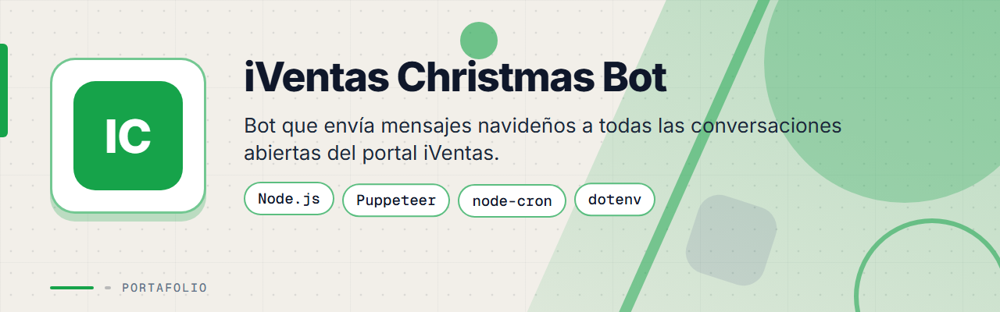
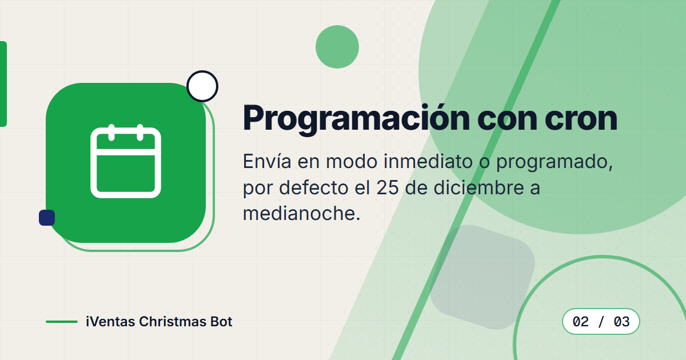
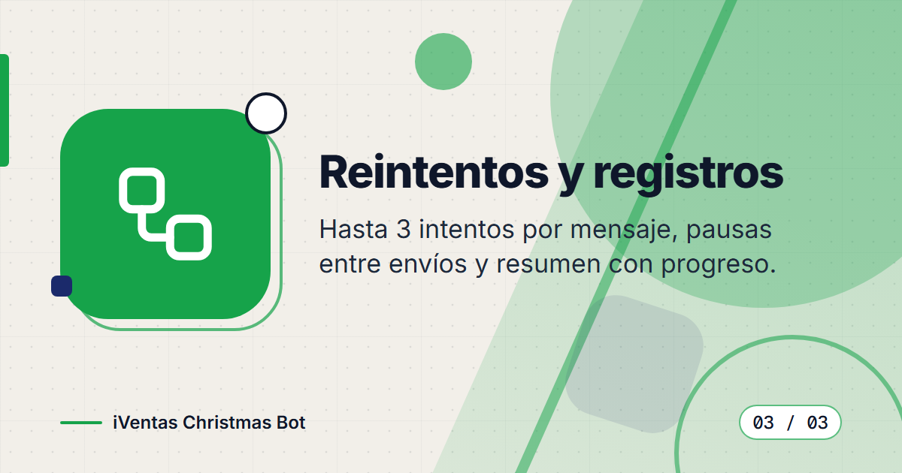
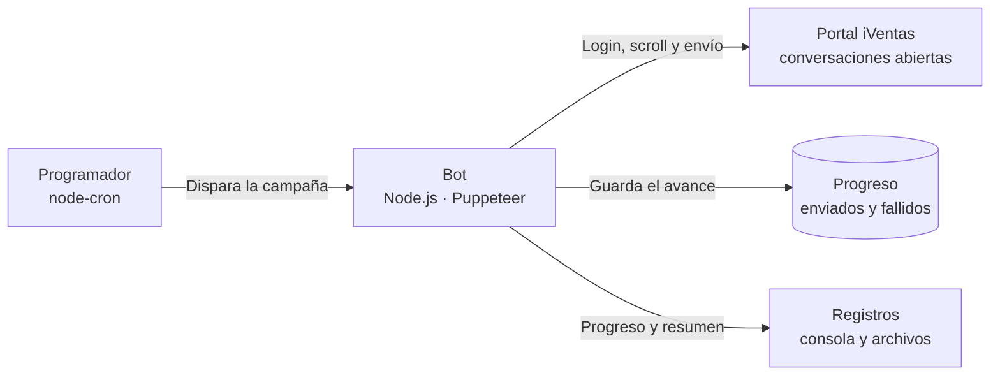

<div align="center">



# Bot de campaña navideña para iVentas


**Bot de automatización que inicia sesión en el portal iVentas, recorre todas las conversaciones abiertas y envía un mensaje navideño a cada cliente en la fecha programada, con reintentos y registro de progreso.**

</div>

> Este es un **portafolio showcase**: el código fuente es propietario y no está incluido.

---

## Contenido

- [El Problema](#el-problema)
- [La Solución](#la-solución)
- [Funcionalidades](#funcionalidades)
- [Vista Previa](#vista-previa)
- [Arquitectura](#arquitectura)
- [Stack Tecnológico](#stack-tecnológico)
- [Instalación local](#instalación-local)
- [Roadmap](#roadmap)
- [Contacto](#contacto)

---

## El Problema

Enviar un saludo de temporada a cientos de clientes por un portal de chat es un trabajo manual y propenso a errores:

- Hay que abrir una por una cada conversación y escribir el mensaje.
- La lista de conversaciones carga por partes, y es fácil olvidar contactos.
- El envío debe ocurrir a una hora precisa, aunque nadie esté frente a la computadora.
- Si algo falla a mitad de camino, no se sabe a quién ya se le envió.

---

## La Solución

Un bot en Node.js con Puppeteer que automatiza el navegador: inicia sesión, desplaza la lista de forma incremental hasta cargar todas las conversaciones, abre cada una y envía el mensaje con una pausa configurable entre envíos. Se programa con una expresión cron (por defecto, el 25 de diciembre a medianoche), reintenta los envíos fallidos y guarda el progreso para poder retomar la campaña sin repetir mensajes.

---

## Funcionalidades

| Funcionalidad | Descripción |
|---------------|-------------|
| Inicio de sesión automático | Entra al portal con las credenciales definidas en variables de entorno |
| Desplazamiento inteligente | Scroll incremental con seguimiento del progreso para cargar todas las conversaciones |
| Programación con cron | Ejecución en la fecha y hora configuradas, o inmediata en modo de prueba |
| Reintentos | Hasta 3 intentos por mensaje antes de marcarlo como fallido |
| Progreso reanudable | Registro de contactos enviados y fallidos para no repetir envíos y reintentar los fallidos |
| Selectores con alternativas | Sistema de selectores con opciones de respaldo y herramienta de mapeo del portal |
| Pausa entre mensajes | Retraso configurable para evitar bloqueos |
| Registros detallados | Logs de color con progreso, estimación de tiempo y resumen final |

---

## Vista Previa

<table>
  <tr>
    <td width="50%">
      
      <br><b>Inicio de sesión automático</b>: el bot entra al portal y carga todas las conversaciones.
    </td>
    <td width="50%">
      
      <br><b>Programación con cron</b>: el envío ocurre en la fecha y hora configuradas.
    </td>
  </tr>
  <tr>
    <td width="50%">
      
      <br><b>Reintentos y registros</b>: reintenta los fallos y guarda el progreso de la campaña.
    </td>
    <td width="50%"></td>
  </tr>
</table>

---

## Arquitectura



El bot incluye un mapeador del portal que genera archivos de selectores recomendados, y un modo de prueba (`--now`) para ejecutar la campaña de inmediato antes de programarla.

---

## Stack Tecnológico

| Capa | Tecnología |
|------|-----------|
| Entorno | Node.js (módulos ES) |
| Automatización del navegador | Puppeteer |
| Programación | node-cron |
| Configuración | dotenv |
| Registros y progreso | Logger propio · archivo de progreso en JSON |

---

## Instalación local

> **Aviso:** el código es privado y propietario. Estos pasos son solo para colaboradores autorizados con acceso al repositorio.

1. Instala Node.js.
2. Instala las dependencias:
   ```bash
   npm install
   ```
3. Crea un archivo `.env` con tus propias credenciales, el mensaje y la expresión cron.
4. Mapea el portal la primera vez para identificar los selectores:
   ```bash
   npm run map
   ```
5. Prueba la campaña de inmediato o déjala programada:
   ```bash
   npm start -- --now
   npm start -- --schedule
   ```

---

## Roadmap

- [ ] Plantillas de mensaje personalizadas por cliente.
- [ ] Reporte final de la campaña en un archivo descargable.

---

## Contacto

El código fuente es propietario. Para consultas o propuestas, escríbeme:

[](mailto:pablozam1931@gmail.com)
[%206517--1870-25D366?style=for-the-badge&logo=whatsapp&logoColor=white)](https://wa.me/50765171870)
[](https://github.com/deadlyrat)

- Correo: [pablozam1931@gmail.com](mailto:pablozam1931@gmail.com)
- WhatsApp: [(507) 6517-1870](https://wa.me/50765171870)
- GitHub: [github.com/deadlyrat](https://github.com/deadlyrat)

---

*Parte del portafolio de [deadlyrat](https://github.com/deadlyrat)*
